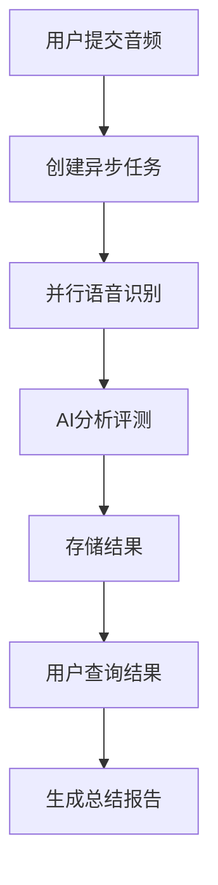
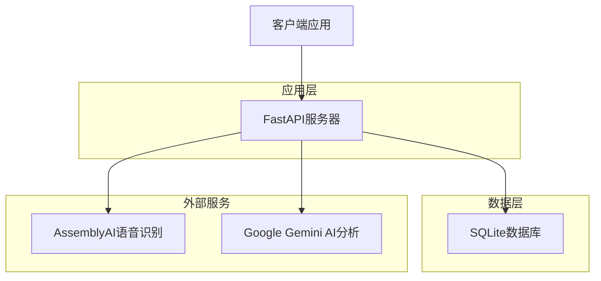
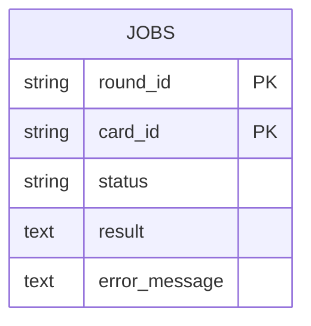

# AI英语复述评测系统 - 产品需求文档 (PRD)

**版本**: 2.0\
**日期**: 2025年1月\
**项目状态**: 开发完成，待部署优化

## 1. 产品概述

AI英语复述评测系统是一个基于人工智能的自动化英语口语复述(Retelling)评测平台。系统通过对比"标准音频"和"用户复述音频"，为中高级英语学习者提供深度、个性化的反馈，帮助他们提升听力理解与口语表达能力。

系统采用"功能对等"评估理念，注重意义传达而非逐词匹配，强调"听口关联"分析，帮助用户发现听力障碍与口语习惯的内在联系。

## 2. 核心功能

### 2.1 用户角色

本系统为单一用户角色设计，无需复杂的权限管理：

| 角色    | 使用方式      | 核心功能               |
| ----- | --------- | ------------------ |
| 英语学习者 | 直接访问API接口 | 上传音频、获取评测结果、查看分析报告 |

### 2.2 功能模块

系统包含以下核心页面和功能：

1. **单句评测接口**: 异步处理单个句子的复述评测
2. **结果查询接口**: 轮询获取单句评测结果
3. **总结报告接口**: 生成整轮练习的综合分析报告
4. **系统监控接口**: API文档和健康检查

### 2.3 页面详情

| 功能模块  | 接口路径                                               | 功能描述                                                |
| ----- | -------------------------------------------------- | --------------------------------------------------- |
| 单句评测  | POST /evaluate-single-card                         | 接收音频文件，创建异步评测任务。支持round\_id和card\_id标识，返回202状态码     |
| 结果查询  | GET /get-single-card-result/{round\_id}/{card\_id} | 查询单句评测状态和结果。返回PENDING/PROCESSING/COMPLETED/FAILED状态 |
| 总结报告  | GET /get-round-summary/{round\_id}                 | 基于完成的单句评测生成综合分析报告，包含模式识别和听口关联分析                     |
| API文档 | GET /docs                                          | FastAPI自动生成的交互式API文档                                |

## 3. 核心流程

### 用户操作流程

1. **提交评测**: 用户通过客户端上传标准音频和复述音频到单句评测接口
2. **轮询结果**: 客户端定期查询评测状态，直到获得完成结果
3. **查看分析**: 获取单句详细分析报告，包含意义保真度、表达对比等
4. **获取总结**: 完成一轮练习后，获取综合分析报告和改进建议

### 系统处理流程



## 4. 用户界面设计

### 4.1 设计风格

* **主色调**: 专业蓝色(#2563eb)和成功绿色(#10b981)

* **辅助色**: 警告橙色(#f59e0b)和错误红色(#ef4444)

* **字体**: 系统默认字体，支持中英文显示

* **布局**: RESTful API设计，JSON格式响应

* **交互**: 异步处理，状态轮询机制

### 4.2 接口响应设计

| 接口类型 | 响应格式     | 关键字段                                           |
| ---- | -------- | ---------------------------------------------- |
| 任务提交 | JSON状态响应 | message, 202状态码                                |
| 结果查询 | JSON详细数据 | status, result, error\_message                 |
| 总结报告 | JSON分析报告 | performance\_overview, key\_patterns\_analysis |

### 4.3 响应式设计

系统为API服务，支持跨平台客户端接入，无特定设备限制。

## 5. 技术架构

### 5.1 架构设计



### 5.2 技术栈

* **后端框架**: FastAPI + Uvicorn

* **数据库**: SQLite

* **语音识别**: AssemblyAI Python SDK

* **AI分析**: Google Gemini Python SDK

* **异步处理**: asyncio + BackgroundTasks

### 5.3 API接口定义

#### 5.3.1 单句评测接口

```
POST /evaluate-single-card
```

**请求参数**:

| 参数名             | 类型     | 必填 | 描述       |
| --------------- | ------ | -- | -------- |
| round\_id       | string | 是  | 练习轮次标识   |
| card\_id        | string | 是  | 句子卡片标识   |
| practice\_audio | file   | 是  | 用户复述音频文件 |
| original\_audio | file   | 是  | 标准音频文件   |

**响应示例**:

```json
{
  "message": "Job submitted and is pending evaluation."
}
```

#### 5.3.2 结果查询接口

```
GET /get-single-card-result/{round_id}/{card_id}
```

**响应示例**:

```json
{
  "round_id": "demo_round_12345",
  "card_id": "card_01",
  "status": "COMPLETED",
  "result": {
    "evaluation_report": {
      "meaning_fidelity": {
        "assessment": "核心意思已准确表达",
        "missing_details": [],
        "added_inaccuracies": []
      },
      "overall_score": 85
    }
  },
  "error_message": null
}
```

#### 5.3.3 总结报告接口

```
GET /get-round-summary/{round_id}
```

**响应示例**:

```json
{
  "performance_overview": {
    "comment": "本轮在意义传达上表现良好",
    "final_score": 82
  },
  "key_patterns_analysis": [
    {
      "pattern_id": 1,
      "observation": "连读处理需要改进",
      "possible_cause": "口语习惯影响听力理解"
    }
  ]
}
```

### 5.4 数据库设计

#### 5.4.1 数据模型



#### 5.4.2 数据表结构

**jobs表**:

```sql
CREATE TABLE jobs (
    round_id TEXT,
    card_id TEXT,
    status TEXT,
    result TEXT,
    error_message TEXT,
    PRIMARY KEY (round_id, card_id)
);
```

**状态枚举**:

* `PENDING`: 任务已提交，等待处理

* `PROCESSING`: 正在处理中

* `COMPLETED`: 处理完成

* `FAILED`: 处理失败

## 6. 系统特性

### 6.1 性能要求

* **并发处理**: 支持多任务并行语音识别

* **响应时间**: 任务提交 < 1秒，单句评测 < 120秒

* **超时设置**: Gemini API调用120秒超时，总结报告180秒超时

* **文件处理**: 支持WAV格式音频文件

### 6.2 可靠性设计

* **错误处理**: 完整的异常捕获和错误信息记录

* **状态管理**: 详细的任务状态跟踪

* **资源清理**: 自动清理临时音频文件

* **数据持久化**: SQLite数据库保证数据安全

### 6.3 安全考虑

* **API密钥管理**: 环境变量存储敏感信息

* **文件上传**: 临时文件存储和自动清理

* **CORS配置**: 跨域请求支持

* **输入验证**: 文件类型和参数验证

### 6.4 部署配置

#### 6.4.1 环境变量

```bash
ASSEMBLYAI_API_KEY=your_assemblyai_key
GEMINI_API_KEY=your_gemini_key
GEMINI_MODEL_NAME=gemini-1.5-flash
```

#### 6.4.2 依赖安装

```bash
pip install fastapi uvicorn assemblyai google-generativeai
```

#### 6.4.3 启动命令

```bash
python main.py
# 或
uvicorn main:app --host 0.0.0.0 --port 8000
```

### 6.5 测试策略

#### 6.5.1 功能测试

* **API接口测试**: 使用test\_client.py进行完整流程测试

* **音频处理测试**: 验证AssemblyAI语音识别准确性

* **AI分析测试**: 验证Gemini分析结果质量

#### 6.5.2 性能测试

* **并发测试**: 多任务同时提交处理

* **超时测试**: 验证各接口超时设置

* **资源监控**: 内存和CPU使用情况

#### 6.5.3 集成测试

* **端到端测试**: 完整的用户使用流程

* **错误恢复测试**: 异常情况处理验证

* **数据一致性测试**: 数据库状态同步验证

## 7. 运维监控

### 7.1 日志管理

* **日志级别**: INFO级别，包含关键操作记录

* **日志格式**: 时间戳 + 级别 + 消息内容

* **错误追踪**: 详细的异常堆栈信息

### 7.2 健康检查

* **API状态**: /docs接口可用性检查

* **数据库连接**: SQLite文件访问验证

* **外部服务**: AssemblyAI和Gemini API连通性

### 7.3 性能监控

* **任务处理时间**: 单句评测和总结报告耗时

* **成功率统计**: 任务完成率和失败率

* **资源使用**: 临时文件清理和数据库大小

## 8. 未来扩展

### 8.1 功能增强

* **多语言支持**: 扩展到其他语言的复述评测

* **实时评测**: WebSocket实时音频流处理

* **个性化模型**: 基于用户历史数据的定制化分析

### 8.2 技术优化

* **缓存机制**: Redis缓存频繁查询结果

* **负载均衡**: 多实例部署和请求分发

* **数据库升级**: PostgreSQL替换SQLite

### 8.3 用户体验

* **Web界面**: 开发用户友好的前端界面

* **移动应用**: 原生移动端应用开发

* **语音合成**: TTS功能辅助学习

