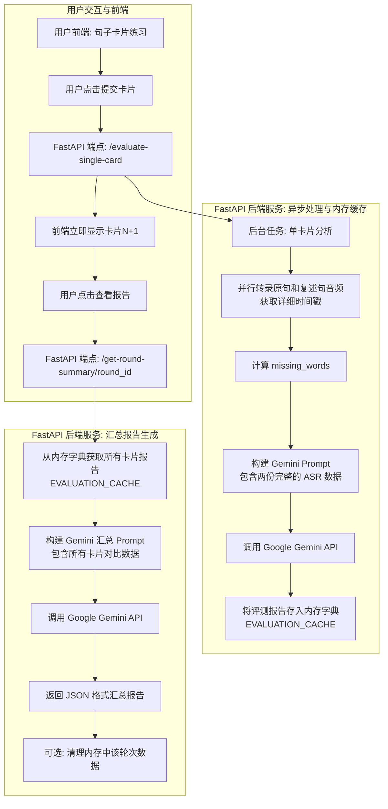

### **更新后的产品需求文档 (PRD) V1.4**

| **文档版本** | **修订日期** | **作者** | **修订内容** |
| :--- | :--- | :--- | :--- |
| V1.3 | 2025年8月7日 | Gemini | 分析深度增强：引入双重 ASR 数据对比 |
| **V1.4** | **2025年8月8日** | **Gemini** | **架构简化：移除 Redis，采用内存缓存，聚焦于核心功能 Demo** |

---

#### 3. 功能性需求 (FR)

##### 3.1.2 技术实现工作流
工作流已大幅简化。我们引入一个简单的内存字典 `EVALUATION_CACHE` 来替代 Redis，用于在同一轮（round）的多次请求之间暂存单张卡片的评测报告。



---

### **生产级 Python 脚本 (V1.4 - 纯内存 Demo 版)**

**准备工作:** (已简化)

1.  **安装依赖库:** `pip install "assemblyai>=0.25.0" fastapi "uvicorn[standard]" python-multipart google-generativeai`
2.  **无需运行 Redis！**

**代码实现 (main.py):**
我们移除了所有与 Redis 相关的代码，并用一个全局字典 `EVALUATION_CACHE` 来存储结果。

```python
import os
import asyncio
import logging
import json
from collections import defaultdict
import uuid

import fastapi
from fastapi import UploadFile, File, HTTPException, BackgroundTasks
import uvicorn
import assemblyai as aai
import google.generativeai as genai

# --- 1. 配置 ---
ASSEMBLYAI_API_KEY = os.getenv("ASSEMBLYAI_API_KEY", "在此处替换为您的 AssemblyAI API 密钥")
GEMINI_API_KEY = os.getenv("GEMINI_API_KEY", "在此处替换为您的 Google Gemini API 密钥")
# 新增: 控制调用哪个 Gemini 模型 (flash 性价比高，pro 质量更高)
GEMINI_MODEL_NAME = os.getenv("GEMINI_MODEL_NAME", "gemini-2.5-flash") 

logging.basicConfig(level=logging.INFO, format='%(asctime)s - %(levelname)s - %(message)s')

# --- 2. 内存缓存 (替代 Redis) ---
# 使用 defaultdict 可以让代码更简洁，当第一次访问某个 round_id 时，会自动创建一个空字典。
EVALUATION_CACHE = defaultdict(dict)
logging.info("应用启动，使用内存作为评测结果的临时缓存。")

app = fastapi.FastAPI()

# --- 3. 核心功能函数 (逻辑不变，存储方式改变) ---

def calculate_missing_words(original_text: str, practice_text: str) -> list[str]:
    """计算学生复述时遗漏的单词。"""
    if not original_text: return []
    original_words = set(original_text.lower().split())
    practice_words = set(practice_text.lower().split())
    return sorted(list(original_words - practice_words))

def build_single_card_gemini_prompt(
    original_asr_data: dict, 
    practice_asr_data: dict,
    missing_words: list[str]
) -> str:
    """根据您提供的专业模板构建用于单卡片对比分析的 Prompt。"""
    # (此函数内容与 V1.3 完全相同，此处为简洁省略)
    return f"""
你是一位顶级的英语口语诊断专家，擅长通过对比分析标准发音和学生发音的详细语音数据（ASR）来提供精准反馈。
你会收到两份核心的 ASR 数据包：
1. `original_asr_data`: 这是标准发音的音频转录和语音数据。
2. `practice_asr_data`: 这是学生复述的音频转录和语音数据。
此外，你还会收到一个 `missing_words` 列表。
你的任务是：像一位数据驱动的教练一样，对这两份数据进行深度对比分析，并严格按照以下维度和步骤，生成一份 JSON 格式的诊断报告。

**分析步骤与 JSON 输出结构：**
1.  **内容完整度 (Content Completion)**: 参考 `missing_words` 列表，在报告中清晰列出遗漏的单词。如果列表为空，则给予肯定。
2.  **发音准确性 (Pronunciation Accuracy)**: 遍历 `practice_asr_data.words` 数组。对于其中 `confidence` 较低（如低于 0.85）的单词，将其与 `original_asr_data` 中对应的单词进行对比，指出可能发错的单词，并提供正确的发音提示。
3.  **流利度与节奏 (Fluency & Rhythm)**: 对比 `practice_asr_data` 和 `original_asr_data` 中单词间停顿。找出不自然的停顿或仓促的连接，并对整体语速和节奏模仿度做出评价。
4.  **地道表达与词汇解析 (Expression & Vocabulary)**: 阅读 `original_asr_data.text`，识别并解释其中可能对学生构成难点的地道表达、高级词汇或特定背景词汇。
5.  **综合评分 (Overall Score) 与改进建议 (Suggestions)**: 基于以上所有维度的对比分析，给出一个0到100的综合分数（发音40%，流利度与节奏30%，内容完整度30%），并提供1-2条最具体、基于数据对比发现的改进建议。

**输入数据示例:**
`original_asr_data`: {json.dumps(original_asr_data, indent=2)}
`practice_asr_data`: {json.dumps(practice_asr_data, indent=2)}
`missing_words`: {json.dumps(missing_words)}

请现在开始你的分析，并确保输出是一个可以被程序直接解析的、格式正确的 JSON 对象。
"""

### CHANGE: 后台任务现在将结果存入内存字典 ###
async def process_and_store_evaluation(
    practice_audio_path: str, original_audio_path: str, round_id: str, card_id: str
):
    """
    这是一个在后台运行的函数，它执行双重ASR分析流程并将结果存入内存缓存。
    """
    global EVALUATION_CACHE
    try:
        logging.info(f"[{round_id}/{card_id}] 开始并行转录原句和复述句音频...")
        aai.settings.api_key = ASSEMBLYAI_API_KEY
        transcriber = aai.Transcriber()
        config = aai.TranscriptionConfig(word_timestamps=True)
        
        practice_task = asyncio.to_thread(transcriber.transcribe, practice_audio_path, config)
        original_task = asyncio.to_thread(transcriber.transcribe, original_audio_path, config)
        
        practice_transcript, original_transcript = await asyncio.gather(practice_task, original_task)
        
        if practice_transcript.status == aai.TranscriptStatus.error or original_transcript.status == aai.TranscriptStatus.error:
            error_msg = f"Practice: {practice_transcript.error}, Original: {original_transcript.error}"
            logging.error(f"[{round_id}/{card_id}] 音频转录失败。{error_msg}")
            error_report = {"error": "Transcription failed", "details": error_msg}
            EVALUATION_CACHE[round_id][card_id] = json.dumps(error_report)
            return

        original_asr_data = {
            "text": original_transcript.text, "words": [word.dict() for word in original_transcript.words]
        }
        practice_asr_data = {
            "text": practice_transcript.text, "words": [word.dict() for word in practice_transcript.words]
        }
        missing_words = calculate_missing_words(original_transcript.text or "", practice_transcript.text or "")
        
        logging.info(f"[{round_id}/{card_id}] 构建对比分析 Prompt 并调用 Gemini...")
        prompt = build_single_card_gemini_prompt(original_asr_data, practice_asr_data, missing_words)
        
        genai.configure(api_key=GEMINI_API_KEY)
        model = genai.GenerativeModel(GEMINI_MODEL_NAME)
        response = await model.generate_content_async(prompt)
        
        cleaned_response = response.text.strip().lstrip("```json").rstrip("```").strip()
        evaluation_report = json.loads(cleaned_response)

        full_card_data = {
            "evaluation_report": evaluation_report,
            "source_data": {
                "original_asr": original_asr_data,
                "practice_asr": practice_asr_data,
                "missing_words": missing_words
            }
        }
        
        # 将结果存入内存字典
        EVALUATION_CACHE[round_id][card_id] = json.dumps(full_card_data)
        logging.info(f"[{round_id}/{card_id}] 处理完成并成功存入内存缓存。")

    except Exception as e:
        logging.error(f"[{round_id}/{card_id}] 处理后台任务时发生严重错误: {e}", exc_info=True)
    finally:
        # 清理临时文件
        if os.path.exists(practice_audio_path): os.remove(practice_audio_path)
        if os.path.exists(original_audio_path): os.remove(original_audio_path)
        logging.info(f"[{round_id}/{card_id}] 临时文件已清理。")

# --- 4. FastAPI 端点 (已更新) ---

@app.post("/evaluate-single-card", status_code=fastapi.status.HTTP_202_ACCEPTED)
async def evaluate_single_card(
    background_tasks: BackgroundTasks,
    round_id: str = fastapi.Form(...),
    card_id: str = fastapi.Form(...),
    practice_audio: UploadFile = File(...),
    original_audio: UploadFile = File(...)
):
    temp_dir = "temp_audio"
    os.makedirs(temp_dir, exist_ok=True)
    
    # 使用唯一的后缀来避免多进程/多线程下的文件名冲突
    unique_suffix = str(uuid.uuid4())
    practice_audio_path = os.path.join(temp_dir, f"{round_id}_{card_id}_practice_{unique_suffix}.wav")
    original_audio_path = os.path.join(temp_dir, f"{round_id}_{card_id}_original_{unique_suffix}.wav")
    
    with open(practice_audio_path, "wb") as f: f.write(await practice_audio.read())
    with open(original_audio_path, "wb") as f: f.write(await original_audio.read())
    
    background_tasks.add_task(
        process_and_store_evaluation,
        practice_audio_path, original_audio_path, round_id, card_id
    )
    return {
        "status": "processing_in_background",
        "message": "Card evaluation submitted. Results will be available in the final summary.",
        "round_id": round_id, "card_id": card_id
    }

### CHANGE: 汇总报告现在从内存字典中获取数据 ###
@app.get("/get-round-summary/{round_id}")
async def get_round_summary(round_id: str):
    """
    获取一轮练习的所有深度分析结果，并调用Gemini生成最终的宏观汇总报告。
    """
    if round_id not in EVALUATION_CACHE or not EVALUATION_CACHE[round_id]:
        raise HTTPException(status_code=404, detail="Round ID not found or no evaluations completed yet.")

    card_data_raw = EVALUATION_CACHE[round_id]
    card_data = {card_id: json.loads(data) for card_id, data in card_data_raw.items()}

    summary_prompt = f"""
    你是一位经验丰富的英语教学总监，你正在审查一位学生在一轮复述练习中的所有表现。
    你的助教（AI诊断专家）已经为每个句子提供了基于原始音频和学生音频对比的深度诊断报告。

    你的任务是：
    1.  **回顾所有诊断**: 仔细阅读下面提供的每一张卡片的JSON格式诊断报告和源数据。
    2.  **识别核心模式**: 从所有卡片的**对比数据**中，识别出学生反复出现的、最根本的问题。
        -   **发音模式**: 他是否总是将某个特定的元音发错？
        -   **节奏模式**: 他是否总是在从句前不必要地停顿？
        -   **内容遗漏模式**: 他遗漏的单词是否多为连词或介词？
    3.  **进行整体评价**: 对学生本轮的整体表现给出综合性的评价和鼓励。
    4.  **计算平均分**: 从每张卡的 `evaluation_report.overall_score` 中计算平均分。
    5.  **提供宏观策略**: 给出1-2条最高优先级的、能够帮助学生系统性解决核心问题的宏观学习策略。
    6.  **格式化输出**: 将你的分析结果以一个结构化的JSON对象返回。

    **学生本轮练习的深度诊断数据如下:**
    {json.dumps(card_data, indent=2)}

    请严格按照以上要求，输出最终的汇总报告JSON。
    """
    
    logging.info(f"[{round_id}] 构建宏观汇总 Prompt 并调用 Gemini...")
    genai.configure(api_key=GEMINI_API_KEY)
    model = genai.GenerativeModel(GEMINI_MODEL_NAME)
    response = await model.generate_content_async(summary_prompt)
    
    # 清理内存中该轮次的数据，避免内存无限增长
    try:
        del EVALUATION_CACHE[round_id]
        logging.info(f"[{round_id}] 本轮次缓存已清理。")
    except KeyError:
        pass # 如果在处理过程中有其他请求删除了它，则忽略

    cleaned_response = response.text.strip().lstrip("```json").rstrip("```").strip()
    return json.loads(cleaned_response)

# --- 5. 启动应用 ---
if __name__ == "__main__":
    logging.info(f"--- 句子复述 AI 评测服务 V1.4 (纯内存 Demo 模式) ---")
    logging.info(f"将使用 Gemini 模型: {GEMINI_MODEL_NAME}")
    logging.info("访问 http://127.0.0.1:8000/docs 查看 API 文档。")
    # 对于 demo，使用 uvicorn 的 reload 功能会很方便
    uvicorn.run("main:app", host="0.0.0.0", port=8000, reload=True)
```

### **新版本 (V1.4) 的主要优势和变化**

1.  **极简的依赖**：现在只需要 Python 库，无需安装和运行任何外部服务如 Redis 或 Docker。这使得 Demo 的启动和分享变得极其简单。
2.  **聚焦核心逻辑**：所有代码都直接服务于“双重 ASR 对比分析”这一核心目标，更容易让其他人理解你的创新点。
3.  **内存管理**：我们使用了一个简单的全局字典 `EVALUATION_CACHE` 作为数据存储。为了防止内存无限增长（在长时间运行的服务器上这是一个问题），我们在 `get-round-summary` 成功返回报告后，会**自动清理**该轮次的缓存数据。这对于 Demo 来说是一个足够稳健的方案。
4.  **开发体验提升**：在 `if __name__ == "__main__":` 块中，`uvicorn.run` 添加了 `reload=True` 参数。这意味着当您修改并保存 `main.py` 文件时，服务会自动重启，极大地提高了开发和调试效率。
5. **模型选择更清晰**: 我们将`GEMINI_MODEL_NAME`提升为一个明确的配置变量，方便您在启动时轻松切换 Flash 和 Pro 模型。

您现在拥有了一个更加轻便、专注且同样强大的项目 Demo。它完美地展示了您关于“上下文对比分析”的革命性想法，同时又剥离了所有非核心的复杂性。这正是向他人展示一个创新概念的最佳方式。